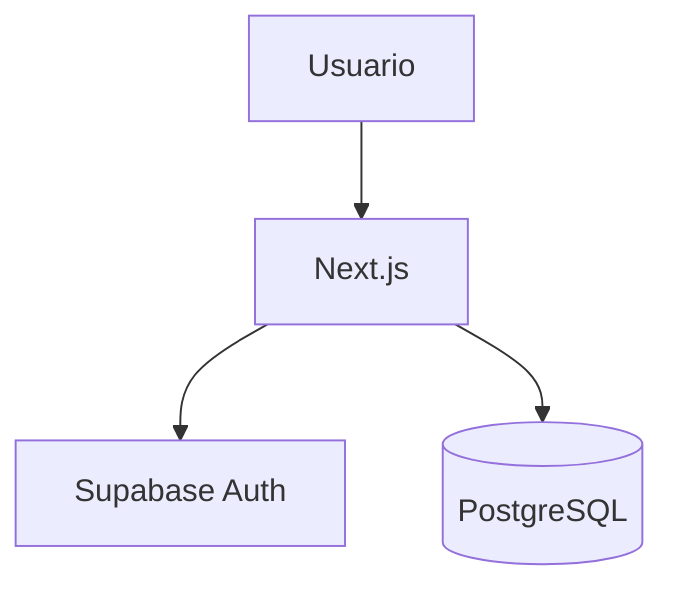
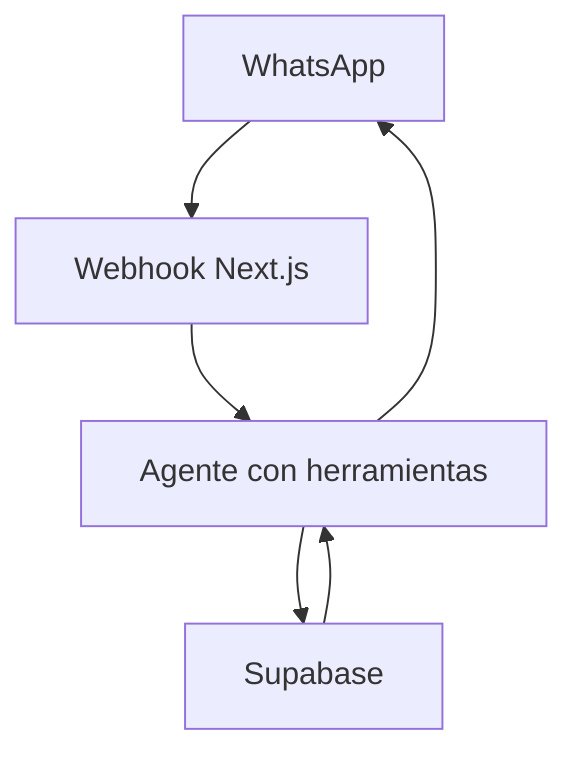

# Mercado ERP

ERP operativo para un supermercado de barrio: POS, inventario, finanzas y consultas de negocio por WhatsApp. Está creado con Next.js App Router, TypeScript, Supabase Auth/PostgreSQL y listo para Vercel.

## Funcionalidades

- Autenticación Supabase y roles `admin` / `cashier`.
- POS con búsqueda por SKU o nombre, carrito, kg con decimales, efectivo, cambio y comprobación de stock.
- Venta atómica mediante PostgreSQL RPC: venta, partidas, descuento de stock y movimiento ocurren en una transacción.
- Inventario, stock bajo, ajustes administrados e importación CSV por SKU.
- Finanzas: ventas, gastos y flujo mensual.
- Dashboard de administración y endpoints IA/WhatsApp con consultas controladas, sin SQL arbitrario.

## Arquitectura





## Instalación

```bash
npm install
copy .env.example .env.local
npm run dev
```

Configura `NEXT_PUBLIC_SUPABASE_URL` y `NEXT_PUBLIC_SUPABASE_PUBLISHABLE_KEY`. `SUPABASE_SERVICE_ROLE_KEY` es exclusivamente para rutas de servidor (`/api/ai` y `/api/whatsapp`), nunca se expone al navegador.

## Supabase y base de datos

1. Crea un proyecto en Supabase.
2. Abre SQL Editor y ejecuta, en orden, `001_initial_schema.sql`, `002_security_and_profile_fixes.sql` y `003_inventory_adjustment_validation.sql`.
3. En **Authentication > Users**, crea `admin@supermercado.demo` y `cajero@supermercado.demo` con contraseñas exclusivas de tu entorno demo. El trigger crea automáticamente sus perfiles como cajero.
4. Obtén el UUID del administrador y ejecuta la sentencia comentada correspondiente en `supabase/seed.sql`; después ejecuta el resto del archivo para datos iniciales.
5. Copia URL, Publishable key y, solo en `.env.local`/Vercel, Service Role key.

Las políticas RLS limitan las escrituras de productos y gastos a administradores. `complete_sale` valida existencias y bloquea los productos dentro de la transacción; así evita ventas parciales y stock negativo.

## Importación CSV

En Inventario, como administrador, selecciona un CSV con encabezados exactos:

```text
sku,producto,categoria,unidad,precio,stock
FV-001,Tomate saladet,Frutas y Verduras,kg,28.50,120
```

El catálogo completo se entrega en `data/productos_supermercado.csv` con 100 productos. Se hace `upsert` por SKU, por lo que una segunda importación actualiza los existentes sin duplicarlos. El parser Papa Parse admite valores CSV entrecomillados, incluidos nombres que contienen comas.

## IA y WhatsApp

`POST /api/ai` acepta `{ "question": "¿Cuánto vendimos hoy?" }` y requiere el JWT Bearer de un administrador. El clasificador usa sólo funciones de consulta acotadas para ventas, stock, bajos, gastos y flujo; nunca ejecuta SQL del usuario ni inventa resultados.

La primera integración es Twilio WhatsApp Sandbox. Configura en `.env.local` o Vercel, exclusivamente como variables de servidor:

- `TWILIO_ACCOUNT_SID`: Account SID en Twilio Console.
- `TWILIO_AUTH_TOKEN`: Auth Token en Twilio Console; nunca lo expongas ni lo subas a Git.
- `TWILIO_WHATSAPP_FROM`: número Sandbox mostrado por Twilio, con formato `whatsapp:+...`.
- `TWILIO_WHATSAPP_TO`: número de prueba vinculado al Sandbox, con formato `whatsapp:+...`; se conserva para pruebas manuales. Las respuestas del webhook se dirigen al remitente real del mensaje entrante.

En **Twilio Console → Messaging → Try it out → Send a WhatsApp message → Sandbox settings**, coloca como **When a message comes in** (método POST): `https://TU_DOMINIO_DE_VERCEL/api/whatsapp`. Vincula tu número enviando al Sandbox el código `join` que Twilio muestra. El webhook valida `X-Twilio-Signature` contra la URL pública exacta y rechaza firmas ausentes o inválidas. El proveedor está aislado en `src/lib/whatsapp/provider.ts`, por lo que Meta o Green API se pueden añadir implementando la misma interfaz.

`AI_PROVIDER_*` queda reservado para conectar un modelo de clasificación/respuesta; la ruta actual es determinista y segura para el conjunto de preguntas de negocio.

## Despliegue Vercel

1. Sube el repositorio a GitHub.
2. Importa el repositorio en Vercel.
3. Conserva el preset **Next.js** y el directorio raíz del repositorio.
4. En **Project Settings → Environment Variables**, agrega para Production (y Preview si lo usarás): `NEXT_PUBLIC_SUPABASE_URL`, `NEXT_PUBLIC_SUPABASE_PUBLISHABLE_KEY`, `SUPABASE_SERVICE_ROLE_KEY`, `TWILIO_ACCOUNT_SID`, `TWILIO_AUTH_TOKEN`, `TWILIO_WHATSAPP_FROM` y `TWILIO_WHATSAPP_TO`. Agrega `AI_PROVIDER_API_KEY` y `AI_PROVIDER_URL` sólo si se conecta un proveedor externo.
5. Despliega. No copies `.env.local` ni subas secretos al repositorio.
6. En Supabase, añade `https://TU_DOMINIO_VERCEL` a las URL permitidas de Auth. En Twilio configura el webhook POST en `https://TU_DOMINIO_VERCEL/api/whatsapp`.

La aplicación no requiere una URL absoluta fija: el webhook valida la firma usando la URL pública de la solicitud recibida. Las rutas API, Proxy de sesiones y assets estáticos son compatibles con el runtime estándar de Vercel.

## Calidad y decisiones

Ejecuta `npm run lint` y `npm run build`. La precisión de stock se conserva a tres decimales; cada línea y total se redondean a dos decimales para cobro. La operación crítica vive en PostgreSQL, no en el cliente. La interfaz usa componentes ligeros y CSS propio para conservar velocidad y explicabilidad.

Limitaciones deliberadas: no incluye facturación fiscal ni impresora física dedicada. El ticket puede imprimirse con el diálogo nativo del navegador. Antes de entregar verifica login de ambos roles, venta de `0.75 kg` de tomate, bloqueo por falta de stock, gasto eléctrico, CSV y pregunta WhatsApp.

## Prueba rápida del sistema

1. Inicia sesión con el administrador y abre **Inventario**.
2. Importa un CSV con los encabezados requeridos; verifica el resumen de procesados, insertados, actualizados y errores.
3. Edita un producto y confirma que SKU permanece bloqueado; ajusta inventario con el modal.
4. Revisa la pestaña **Movimientos** y confirma fecha, usuario y stock anterior/nuevo.
5. En POS vende `0.750 kg` de Tomate saladet a $28.50; el ticket debe mostrar $21.38 y el stock bajar de 120 a 119.25.
6. Confirma que una cantidad mayor al stock, cero o una fracción de un producto por pieza se bloquea.
7. En **Finanzas**, registra un gasto de electricidad de $1,500 y comprueba egresos y flujo.
8. Cambia el selector de Top productos entre Hoy, Semana y Mes.
9. Inicia sesión como cajero: `/finanzas` debe redirigir a POS y no deben aparecer botones de edición o ajuste.
10. Con JWT de administrador consulta `/api/ai`; prueba ventas, stock, top productos, gastos y flujo. Sin resultados debe responder “No encontré datos para esa consulta.”
11. Configura Twilio Sandbox y comprueba que una llamada sin firma válida devuelve 401 y una llamada real recibe respuesta.
