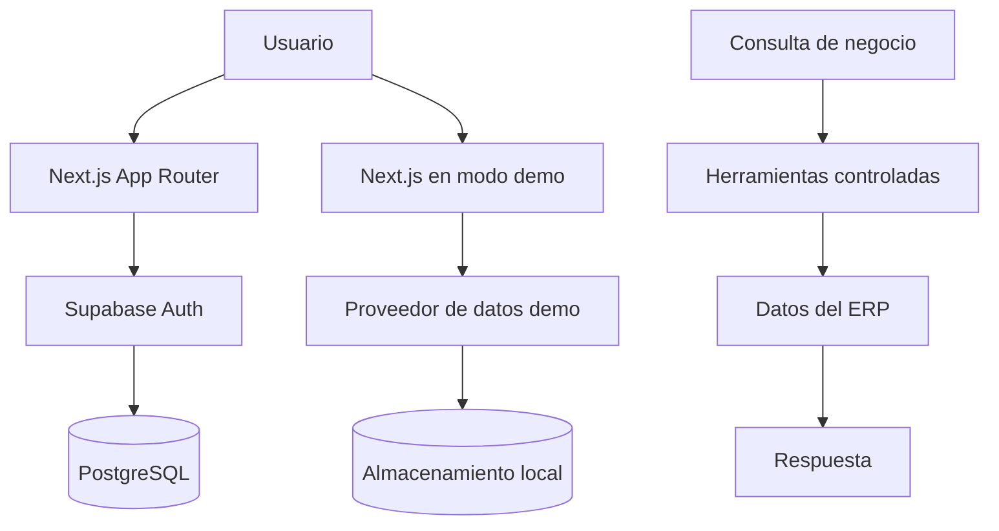

# Mercado Central — ERP Supermercado

> Sistema integral para punto de venta, inventarios, finanzas y consultas inteligentes del negocio.

[](https://nextjs.org/) [](https://www.typescriptlang.org/) [](https://supabase.com/) [](https://vercel.com/) [](https://playwright.dev/)

## 🚀 Demo en vivo

**Aplicación:** [prueba-tecnica-davinci-vercel-app.vercel.app](https://prueba-tecnica-davinci-vercel-app.vercel.app)

### Administrador

| Campo | Valor |
|---|---|
| Email | `admin@supermercado.demo` |
| Password | `AdminDemo2026!` |
| Permisos | Dashboard, POS, inventario, ajustes y finanzas |

### Cajero

| Campo | Valor |
|---|---|
| Email | `cajero@supermercado.demo` |
| Password | `CajeroDemo2026!` |
| Permisos | POS y consulta de inventario |

El cajero no puede acceder a finanzas, editar productos ni ajustar inventario. Estas credenciales pertenecen exclusivamente al entorno de demostración y no dan acceso a sistemas productivos.

## 📦 Entregables

| Entregable | Enlace |
|---|---|
| Aplicación | [Demo pública](https://prueba-tecnica-davinci-vercel-app.vercel.app) |
| Repositorio | [Branduwu/prueba-tecnica-davinci.vercel.app](https://github.com/Branduwu/prueba-tecnica-davinci.vercel.app) |
| Video de avances | PENDIENTE de enlace externo final |
| PDF ejecutivo | [Ver informe ejecutivo](https://drive.google.com/file/d/1YLYgbnqHulY7gH6ri8Egg0p9gNrG0OwJ/view?usp=sharing) |

## 🧩 Módulos

| Módulo | Funcionalidad |
|---|---|
| POS | Búsqueda por SKU/nombre, cobro, peso, cambio y ticket |
| Inventario | Stock decimal, ajustes, movimientos y catálogo CSV |
| Finanzas | Ventas por periodo, gastos, flujo neto y productos más vendidos |
| Usuarios | Roles de administrador y cajero con permisos diferenciados |
| Agente | Consultas de negocio con herramientas controladas |
| WhatsApp | Demostración del flujo conversacional del negocio |

## 🏗️ Arquitectura



El proyecto admite dos proveedores de datos. En un entorno configurado usa Supabase y PostgreSQL; en la demo pública utiliza un estado autocontenido para que el recorrido sea evaluable sin claves externas.

## 🧠 Decisiones técnicas

- **Next.js App Router + TypeScript:** separación clara entre interfaz, rutas y lógica.
- **Proveedores de datos desacoplados:** una misma experiencia puede operar con Supabase o con el modo demo.
- **POS de cantidades precisas:** artículos por kilogramo admiten decimales; piezas, paquetes y manojos exigen enteros.
- **Persistencia transaccional:** el flujo Supabase usa RPCs para completar ventas y ajustar inventario de forma consistente.
- **Roles definidos:** el servidor y la interfaz contemplan administrador y cajero.
- **Calidad reproducible:** Playwright registra el recorrido funcional y visual del modo demo.

## 🧪 Validación E2E

La suite de Playwright verifica los recorridos de administrador y cajero, login, permisos, catálogo, venta por peso, cambio, ticket, inventario, movimientos, finanzas, agente de negocio y simulación de WhatsApp.

```bash
npm run test:e2e:demo
```

Al finalizar se generan el video, subtítulos, capturas finales y el reporte de integridad visual en [`docs/evidence/`](docs/evidence/README.md):

- Video: `docs/evidence/videos/erp-demo-mode-e2e.webm`
- Subtítulos: `docs/evidence/videos/erp-demo-mode-e2e.srt`
- Capturas: `docs/evidence/screenshots/final/`
- Reporte: `docs/evidence/visual-audit.md`

## 📄 Informe ejecutivo

Documento de avance dirigido al dueño del supermercado, enfocado en beneficios operativos, capacidades actuales y siguientes etapas.

[Ver PDF ejecutivo](https://drive.google.com/file/d/1YLYgbnqHulY7gH6ri8Egg0p9gNrG0OwJ/view?usp=sharing)

## Instalación local

```bash
git clone https://github.com/Branduwu/prueba-tecnica-davinci.vercel.app.git
cd prueba-tecnica-davinci.vercel.app
npm install
```

### Modo demo

Para ejecutar el ERP sin Supabase, crea un archivo `.env.local` ignorado por Git:

```env
NEXT_PUBLIC_DEMO_MODE=true
```

No definas variables de Supabase en este modo. Después inicia la aplicación:

```bash
npm run dev
```

### Modo Supabase

Para conectar una instancia real, desactiva el modo demo y define las variables en `.env.local`:

```env
NEXT_PUBLIC_DEMO_MODE=false
NEXT_PUBLIC_SUPABASE_URL=https://<proyecto>.supabase.co
NEXT_PUBLIC_SUPABASE_PUBLISHABLE_KEY=<publishable-key>
SUPABASE_SERVICE_ROLE_KEY=<solo-servidor>
```

La clave de servicio sólo se usa en el servidor y no debe publicarse. Consulta [`.env.example`](.env.example) para el inventario completo de variables opcionales de IA y WhatsApp.

## Supabase y seguridad

Las migraciones están en [`supabase/migrations/`](supabase/migrations/) y se aplican en este orden:

1. `001_initial_schema.sql`: tablas, relaciones, funciones y bases de seguridad.
2. `002_security_and_profile_fixes.sql`: perfiles, roles y ajustes de seguridad.
3. `003_inventory_adjustment_validation.sql`: validaciones de ajustes e inventario.

El modelo incluye `profiles`, `products`, `sales`, `sale_items`, `inventory_movements` y `expenses`. Las políticas RLS limitan las operaciones administrativas, mantienen consulta de inventario para cajeros y protegen la información financiera. La RPC `complete_sale` centraliza la venta, los items y el descuento de stock.

## Catálogo CSV

El importador usa Papa Parse y acepta exactamente estas columnas:

```text
sku,producto,categoria,unidad,precio,stock
```

La importación valida datos, muestra errores y realiza UPSERT por SKU para no duplicar productos. El archivo oficial puede colocarse en `data/productos_supermercado.csv` antes de importarlo desde Inventario.

## IA y WhatsApp

El agente usa herramientas internas predefinidas para consultar datos de negocio; no genera SQL arbitrario. Las variables `AI_PROVIDER_API_KEY`, `AI_PROVIDER_URL`, `TWILIO_ACCOUNT_SID`, `TWILIO_AUTH_TOKEN`, `TWILIO_WHATSAPP_FROM` y `TWILIO_WHATSAPP_TO` son opcionales y deben permanecer exclusivamente en el servidor.

La pantalla de WhatsApp de la demo es una simulación honesta del flujo; no afirma que exista una conexión Twilio activa.

## Despliegue

El proyecto se despliega como Next.js en Vercel. Para la demo pública se utiliza:

```env
NEXT_PUBLIC_DEMO_MODE=true
```

Para una instalación conectada a Supabase, configura las variables correspondientes en Vercel sin versionar archivos `.env.local`, claves de servicio, tokens de Twilio ni claves de IA.

## Limitaciones y siguientes etapas

- La demo pública conserva los cambios sólo en el navegador del evaluador.
- La activación real de Supabase Cloud, proveedor de IA y Twilio requiere sus propias credenciales y configuración externa.
- Como siguiente etapa se pueden integrar reportes exportables, administración de usuarios y pruebas E2E contra un entorno productivo controlado.
